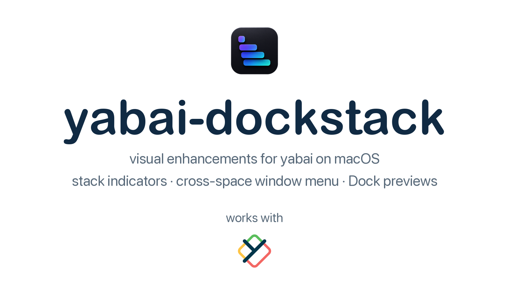
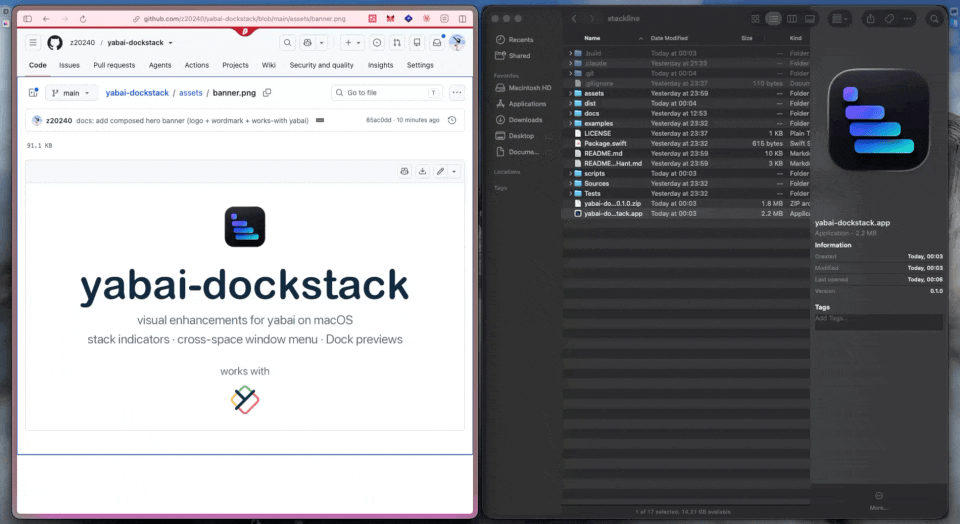
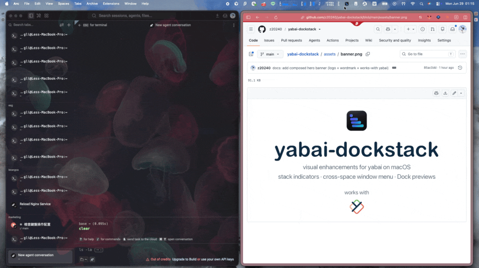
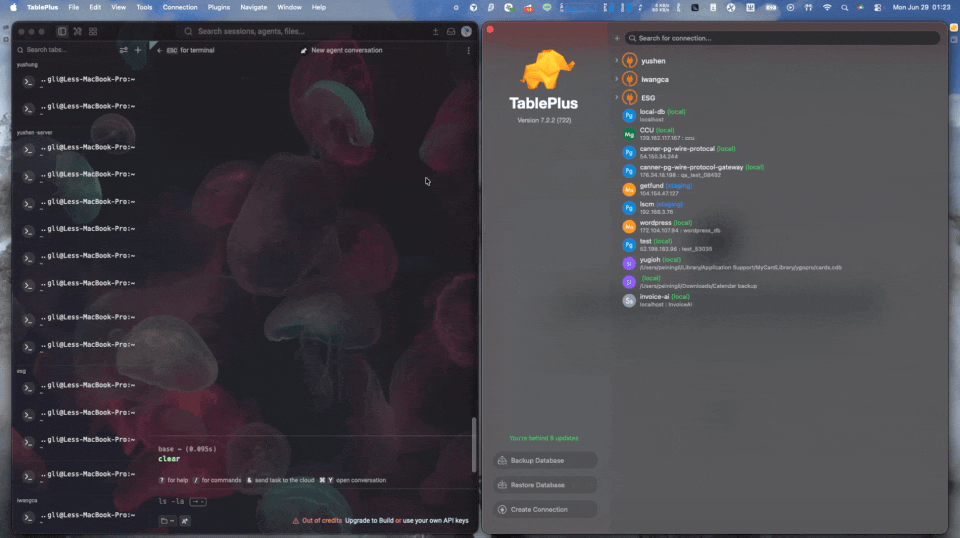
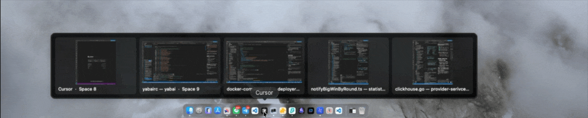

<div align="center">



[](https://github.com/z20240/yabai-dockstack/releases)
[](https://github.com/z20240/yabai-dockstack/stargazers)
[](LICENSE)


English · [繁體中文](README.zh-Hant.md)

<sub>Inspired by [stackline](https://github.com/AdamWagner/stackline) and DockView ·
keywords: yabai, stackline, dockview, macOS window manager, tiling, stack indicator,
dock preview, window switcher, menu bar, Mission Control alternative</sub>

</div>

---

`yabai-dockstack` adds the visual layer that yabai lacks:

- **Stack indicators** — a floating indicator next to each window stack so you see, at
  a glance, which apps are stacked and in what order (inspired by **stackline**).
- **Cross-space window menu** — every window grouped by Display → Space in the menu
  bar; click to jump and focus.
- **Dock window previews** — hover a Dock icon to peek an app's windows across all
  spaces with thumbnails; click to jump (inspired by **DockView**).

It is a clean Swift rewrite — **not** a fork of stackline (which required Hammerspoon).

## Demo

**Stack indicators** — see at a glance which apps are stacked and where.



**Cross-space window menu** — every window grouped by Display → Space; click to jump.



**Jump & focus across spaces** — one click brings you to the window's space.



**Dock window previews** — hover a Dock icon to peek an app's windows; click to jump.



## Features

- 🚦 One floating indicator per stack, placed at the window's outer screen edge.
- 🅰️ **Icon mode** (default): app icons stacked top→bottom in stack-index order;
  focused window highlighted. **Flag mode**: slim minimal markers. Toggle from
  the menu bar.
- 🔎 **Hover** an indicator → popover with that window's full title.
- 🖱️ **Click** an indicator → focus that window (via yabai).
- 🖥️ Multi-monitor, all visible spaces.
- ⌃⌘← ⌃⌘→ **Send to space hotkeys** — move windows left/right one space, or to
  a numbered space, with SIP fully enabled (simulated native gestures).
- 🪶 No Hammerspoon. Core stack indicators need no special permissions (focus is
  delegated to yabai); Dock previews and the SIP-free space hotkeys use
  Accessibility, and Dock previews also need Screen Recording.

## Requirements

- macOS 14+
- **[yabai](https://github.com/koekeishiya/yabai) — required.** yabai-dockstack is a
  companion for yabai and does nothing on its own: every feature reads window/stack
  state from `yabai -m query`. Without it the menu bar just shows
  **"yabai: not found"**. yabai must be installed, **running**, and set up enough to
  create stacks (see yabai's install/configuration guide).

## Install

### Homebrew (recommended)

```sh
brew install --cask z20240/tap/yabai-dockstack
```

Universal (Apple Silicon + Intel). The app is ad-hoc signed but **not
Apple-notarized**, so Gatekeeper would normally block it — the cask strips the
quarantine attribute on install (postflight) so it opens without a prompt. If you
download the release zip manually instead, run once:
`xattr -dr com.apple.quarantine /Applications/yabai-dockstack.app` (or System
Settings → Privacy & Security → **Open Anyway**).

**yabai is required and is NOT installed automatically** (it lives in a third-party
tap that a cask can't auto-tap). Install and start it:

```sh
brew tap koekeishiya/formulae
brew install yabai
yabai --start-service          # see yabai's docs for full setup (incl. SIP)
open -a yabai-dockstack
```

If yabai isn't found on launch, the app shows a **setup guide** (Install yabai via
Terminal · Open install guide · Set yabai path) and a red **"yabai not found — set
up…"** item in the menu bar. It starts working automatically once yabai is running.

### Build from source

```sh
./scripts/bundle.sh        # produces yabai-dockstack.app
open yabai-dockstack.app
```

> **Toolchain note.** Builds with full Xcode or standalone Command Line Tools. If
> `swift build` complains about the Xcode license, run `sudo xcodebuild -license
> accept`, or build against CLT:
> `DEVELOPER_DIR=/Library/Developer/CommandLineTools ./scripts/bundle.sh`.
> The XCTest suite needs full Xcode; a toolchain-independent check is
> `swift run yst-selftest`.

### First launch

On launch the app:

- **auto-detects** the yabai binary (Homebrew Apple Silicon / Intel / nix, then `which`);
- **auto-registers** the yabai signals it needs (pointing at its own path), so you
  never edit `~/.yabairc`. This is idempotent — re-running is safe.

The menu-bar menu shows **yabai: connected ✓** when it found yabai, then a live
list of every window grouped by **Display → Space** (the focused window is
checked). Spaces show their custom yabai label if set (`yabai -m space --label`),
otherwise "Space N". Clicking a window jumps to its space and focuses it. It also
offers:

- **Settings…** — a window to adjust style (icon/flag), indicator size, focused/
  unfocused opacity, flag color, background pill + color, "keep inside window gap",
  full-width side, **Debounce (ms)** / **Poll interval (ms)**, **yabai path**
  (blank = auto-detect; a manual escape hatch if detection fails), and **Start at
  login**. Changes apply live and are saved.
- **Re-register yabai signals** — re-applies the signals if yabai was restarted.

> First launch of an unsigned app: macOS Gatekeeper will block it once. Right-click
> the app → **Open**, or run `xattr -dr com.apple.quarantine yabai-dockstack.app`.
> To remove this step entirely you'd need an Apple Developer ID signature +
> notarization.

> Move `yabai-dockstack.app` to `/Applications` before enabling **Start at login**
> so the login item points at a stable location.

### Manual setup (optional / fallback)

If you prefer to manage signals yourself (e.g. persisted in your dotfiles), the
legacy helpers are still provided: `examples/yabairc-signals.sh` (set `BIN`, source
from `~/.yabairc`) and `examples/com.yabai-dockstack.agent.plist` (a LaunchAgent).
You don't need these for the default flow.

## Configuration

Optional config file at `~/.config/yabai-dockstack/config.json`. Any omitted key
falls back to its default. All keys:

```json
{
  "yabaiPath": "/opt/homebrew/bin/yabai",
  "socketPath": "/tmp/yabai-dockstack.sock",
  "style": "icon",
  "cellSize": 32,
  "offset": 4,
  "focusedAlpha": 1.0,
  "unfocusedAlpha": 0.4,
  "debounceSeconds": 0.05,
  "pollSeconds": 3.0,
  "fullWidthSide": "left",
  "edgeInset": 6,
  "flagColor": "#4C8DFF"
}
```

- `fullWidthSide`: which edge the indicator goes to for a near-full-width window
  (≥90% of the screen), where there's no clear left/right bias. `"left"` (default)
  or `"right"`. Narrower windows still follow their on-screen position.
- `edgeInset`: extra pixels to keep the indicator off the very screen edge when it
  would otherwise clamp there (so it doesn't sit on a window's rounded corner).
- `flagColor`: flag-mode bar color, `"#RRGGBB"` or `"#RRGGBBAA"`.
- `showBackground`: draw a rounded backing pill behind the indicators so they read
  as a floating chip (helpful over full-width windows). `true`/`false`.
- `backgroundColor`: backing pill color, `"#RRGGBB"` / `"#RRGGBBAA"`.

Most of these are adjustable from **Settings…** in the menu bar (no file editing
needed). The config file is still created automatically on first launch at
`~/.config/yabai-dockstack/config.json` for anyone who prefers editing by hand.
- `debounceSeconds`: lower = snappier focus highlight, higher = fewer redraws
  during window drags.

- `style`: `"icon"` or `"flag"`. The menu-bar "Toggle icon/flag" item flips this
  and writes it back to the config file.
- `debounceSeconds`: minimum interval between redraws when events arrive in a
  burst.
- `pollSeconds`: low-frequency fallback refresh, in case a signal is missed.

Use **Reload config** in the menu after editing the file by hand.

## How it works

```
yabai window event ──▶ ~/.yabairc signal runs: yabai-dockstack --refresh
                                                    │ (pokes unix socket)
                                                    ▼
                       SignalListener ──▶ RefreshCoordinator (debounced)
                                                    │
                          yabai -m query --windows  ▼
                       StackBuilder ──▶ IndicatorLayout + CoordinateMapper
                                                    │
                                          OverlayRenderer (one NSPanel per stack)
```

A low-frequency timer also triggers a refresh as a safety net. Focusing a window
is delegated to `yabai -m window --focus`, so the app itself needs no
Accessibility permission.

## Testing

- **Toolchain-independent self-test** (works with Command Line Tools), covering
  decode, stack grouping, layout, coordinate mapping, config, diffing, and the
  socket round-trip:
  ```sh
  swift run yst-selftest
  ```
  Pass a captured query to exercise the live decode path:
  ```sh
  yabai -m query --windows > /tmp/q.json && swift run yst-selftest /tmp/q.json
  ```
- **Full XCTest suite** (requires Xcode):
  ```sh
  swift test
  ```
- **Replay mode** — render indicators from a static JSON dump without live yabai,
  for visual checks:
  ```sh
  .build/debug/yabai-dockstack --replay Tests/YabaiDockstackKitTests/Fixtures/query-sample.json
  ```

## Acceptance checklist

1. `./scripts/bundle.sh` produces `yabai-dockstack.app`.
2. `open yabai-dockstack.app` → a `▦` item appears in the menu bar; the menu shows
   **yabai: connected ✓** (signals were auto-registered — verify with
   `yabai -m signal --list | grep yabai-dockstack`).
3. Create a stack: `yabai -m window --stack next`.
5. Icons appear beside the stacked window, top→bottom in stack order; the focused
   window's icon is brightest.
6. Hover an icon → a tooltip shows that window's title (multiple VSCode windows
   show distinct project names).
7. Click a non-focused icon → that window comes to front; highlight updates.
8. Menu bar → **Toggle icon/flag** switches appearance and persists it.
9. On a second display, indicators appear correctly placed on that screen.
10. LaunchAgent makes it start at login.

## Send to space hotkeys

Send the focused window to an adjacent space or jump it to a numbered space:

- **⌃⌘←** — send left one space
- **⌃⌘→** — send right one space
- **⌃⌘1–9** — send to space N

These hotkeys work **with System Integrity Protection (SIP) fully enabled**. The app
simulates the native macOS gesture — grabs the window by its titlebar and presses
Mission Control's left/right navigation keys — so you see the normal space-switch
slide animation (one hop per space, multi-hop walks visibly step through).

If you disable SIP to load yabai's scripting addition, the original yabai fast path
is used automatically for instant, animation-free moves.

**Requires:**
- The app running.
- Accessibility permission (reuses the Accessibility permission the app already requests for Dock previews).
- Mission Control's **Move left/right a space** shortcuts left enabled (macOS
  default).

**Limitations:**
- Windows without a draggable titlebar area at top-center (e.g., fullscreen games)
  cannot be moved this way.
- A target display currently showing a macOS-fullscreen space cannot receive windows.
- Do not touch the mouse or keyboard during the ~1–2 second simulation.
- Apps whose tab bar fills the titlebar center (some browsers/terminals) may not
  move — the simulated drag can grab a tab instead of the titlebar. Workaround:
  move such windows by their title area manually, or via yabai with the
  scripting addition (SA).

## Dock window previews

Hover a **Dock app icon** to pop up that app's windows across all spaces; click one
to jump to its space and focus it (like a Windows-taskbar peek / DockView).

- **Thumbnails:** a live thumbnail is shown for windows on a currently-visible
  space. For windows on **other spaces** macOS cannot produce a live image
  (verified: ScreenCaptureKit returns `-3811` for off-screen windows), so the app
  shows the **last cached thumbnail** (captured while the window was on-screen) or,
  if none, the **app icon + title**. Either way the entry is clickable.
- **Permissions:** this feature needs **Accessibility** (to detect the hovered
  Dock icon) and **Screen Recording** (to capture thumbnails). Open **Settings →
  Permissions**: it shows each permission's live status (✓ / ✗) with a **Grant…**
  button that requests the permission and opens the exact System Settings pane —
  one at a time, so the two prompts don't collide. Once Accessibility is granted
  the feature activates automatically (no relaunch). If a permission is missing it
  stays dormant — the core stack indicators need no permissions at all.
- **Toggle:** Settings → **Dock window previews** (on by default).

## Is it safe? (signing & permissions)

yabai-dockstack is open-source (MIT) and free. It is **intentionally not signed
with a paid Apple Developer ID nor notarized** — that costs $99/yr and this is a
community project, not a paid product. Consequences and what that means for you:

- **Gatekeeper warns on first open.** Open it once via right-click → **Open**,
  or System Settings → Privacy & Security → **Open Anyway**, or
  `xattr -dr com.apple.quarantine /Applications/yabai-dockstack.app`. The Homebrew
  cask strips quarantine for you, so `brew install --cask` just opens.
- **Don't want to trust a prebuilt binary?** Build it yourself:
  `./scripts/bundle.sh`. It's a few hundred lines of Swift you can read end to end.
- **No network, no analytics, no phone-home.** It only shells out to your local
  `yabai` and (for previews) captures windows locally.

**Permissions — only what each feature needs:**

| Feature | Permissions |
|---|---|
| Stack indicators + cross-space window menu | **none** (just `yabai -m query` / `--focus`) |
| Dock window previews | **Accessibility** (detect the hovered Dock icon) + **Screen Recording** (window thumbnails) |

If you don't use Dock previews, you can grant nothing at all. Permissions are
requested only when that feature is enabled, and the app stays functional without
them.

## App icon

The icon lives in `assets/`. Two variants are generated from
`assets/icon-source.png`:

- `AppIcon-native.icns` — content padded on a transparent canvas with rounded
  corners (macOS HIG style). **This is the bundled default** (`AppIcon.icns`).
- `AppIcon-fullbleed.icns` — the source as-is, square corners.

See `assets/icon-preview.png` for a side-by-side. To switch the bundled icon to
full-bleed, copy `assets/AppIcon-fullbleed.icns` over `assets/AppIcon.icns` and
rebuild. To regenerate everything after editing the source:

```sh
python3 scripts/make-icons.py   # requires Pillow + macOS iconutil
```

> Note: the name/logo use "yabai". This is an **unofficial** community tool and is
> not affiliated with the yabai project.

## License

MIT.
