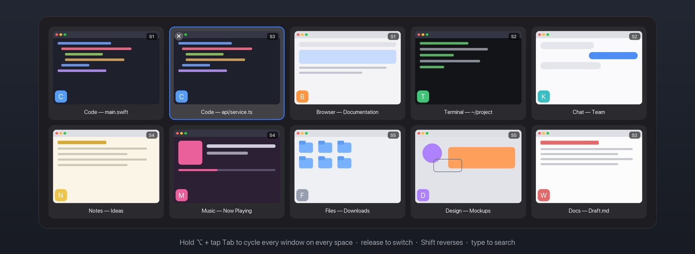

<div align="center">


[](https://github.com/z20240/yabai-dockstack/releases)
[](https://github.com/z20240/yabai-dockstack/stargazers)
[](LICENSE)


[English](README.md) · 繁體中文

<sub>靈感來自 [stackline](https://github.com/AdamWagner/stackline)、DockView 與 AltTab ·
關鍵字:yabai、stackline、dockview、alt-tab、macOS 視窗管理、tiling、stack 指示器、
dock 預覽、視窗切換器、cmd-tab 替代、選單列、Mission Control 替代</sub>

</div>

---

`yabai-dockstack` 幫 yabai 補上它缺的視覺層:

- **Stack 指示器** —— 在每個視窗 stack 旁顯示浮動指示器,讓你一眼看出哪些 app 疊在一起、順序為何(靈感來自 **stackline**)。
- **跨 space 視窗選單** —— 選單列依 Display → Space 列出所有視窗;點一下就跳轉並聚焦。
- **Dock 視窗預覽** —— 滑鼠移到 Dock 圖示,偏看該 app 跨所有 space 的視窗縮圖;點一下跳轉(靈感來自 **DockView**)。
- **AltTab 風格視窗切換器** —— 按住 ⌥ 輕點 Tab:跨所有 space、**每個視窗一格縮圖**
  (不是每個 app 一個圖示),依最近使用排序;放開 ⌥ 即切換。五個編輯器視窗終於分得出來
  —— 這正是 ⌘⇥ 做不到的事(靈感來自 **AltTab**)。

這是用 Swift 重寫的乾淨版本,**不是** stackline 的 fork(stackline 需要 Hammerspoon)。

## Demo

**視窗切換器** —— 所有 space 的所有視窗,一個按鍵直達。



**Stack 指示器** —— 一眼看出哪些 app 疊在一起、在哪裡。


**跨 space 視窗選單** —— 所有視窗依 Display → Space 分組,點一下跳轉。


**跨 space 跳轉聚焦** —— 一鍵跳到該視窗所在的 space。


**Dock 視窗預覽** —— 滑鼠移到 Dock 圖示偏看該 app 的視窗,點一下跳轉。


## 需求

- macOS 14+
- **[yabai](https://github.com/koekeishiya/yabai) —— 必要。** yabai-dockstack 是 yabai 的
  輔助工具,沒有 yabai 就**完全無法運作**:所有功能都靠 `yabai -m query` 取得視窗/stack
  狀態。沒有 yabai 時選單列只會顯示 **「yabai: not found」**。yabai 必須**安裝、執行中、
  且設定到能建立 stack**(請參考 yabai 的安裝/設定說明)。

## 安裝

### Homebrew(推薦)

```sh
brew install --cask z20240/tap/yabai-dockstack
```

Universal(Apple Silicon + Intel)。app 是 ad-hoc 簽章但**沒有經過 Apple notarize**,
原本會被 Gatekeeper 擋——cask 會在安裝後(postflight)移除 quarantine,所以不會跳警告。
若你是手動下載 release zip,請執行一次:
`xattr -dr com.apple.quarantine /Applications/yabai-dockstack.app`(或系統設定 →
隱私權與安全性 → **仍要打開**)。

**yabai 是必要的,但不會自動安裝**(它在第三方 tap,cask 無法自動 tap)。請自行安裝並啟動:

```sh
brew tap koekeishiya/formulae
brew install yabai
yabai --start-service          # 完整設定(含 SIP)見 yabai 官方文件
open -a yabai-dockstack
```

若啟動時找不到 yabai,app 會跳出**設定導引**(用 Terminal 安裝 yabai · 開啟安裝說明 ·
設定 yabai 路徑),選單列也會出現紅色 **「yabai not found — set up…」**。yabai 一旦
啟動,功能會自動開始運作。

### 從原始碼建置

```sh
./scripts/bundle.sh        # 產生 yabai-dockstack.app
open yabai-dockstack.app
```

> 若 `swift build` 抱怨 Xcode 授權,執行 `sudo xcodebuild -license accept`,或改用
> Command Line Tools:`DEVELOPER_DIR=/Library/Developer/CommandLineTools ./scripts/bundle.sh`。

### 首次啟動

啟動後 app 會:

- **自動偵測** yabai 位置(Homebrew Apple Silicon / Intel / nix,再 `which`);
- **自動註冊** 它需要的 yabai signal(指向自己),你完全不用改 `~/.yabairc`。

選單列會顯示 **yabai: connected ✓**,並列出所有視窗(依 Display → Space 分組,
有命名的 space 顯示自訂名稱)。它還提供:

- **Settings…** —— 調整外觀(icon/旗標)、大小、透明度、顏色、底板、滿版靠邊、
  計時(ms)、**yabai 路徑**(留空 = 自動偵測)、**開機自啟**。即時生效並儲存。
- **Re-register yabai signals** —— yabai 重啟後重新註冊 signal。

> 第一次開啟未簽章的 app,macOS 會擋一次:對 app 按右鍵 →「打開」,或執行
> `xattr -dr com.apple.quarantine yabai-dockstack.app`。用 Homebrew cask 安裝則會
> 自動移除 quarantine,不會跳警告。

## 視窗切換器(AltTab 風格)

macOS 的 ⌘⇥ 一個 app 只給一個圖示,五個編輯器視窗根本分不出來。這個切換器**每個視窗
一格**、涵蓋**所有 space**、依最近使用排序:

| 按鍵 | 動作 |
|---|---|
| 按住 **⌥** + 輕點 **Tab** | 循環**所有 space 的所有視窗**(⇧ 反向) |
| 按住 **⌥** + 輕點 **`** | 只循環**目前 App** 的視窗 |
| 方向鍵 / **W** 或 ✕ / **Esc** / **Enter** | 移動選擇 / 關閉視窗 / 取消 / 確認 |
| 放開 **⌥** | 切換到選中的視窗(透過 yabai 跨 space 跳轉) |

- **兩種模式。**「按住循環」(上表)手感等同原生 ⌘⇥;「黏性模式」面板會停留,
  並支援**打字搜尋**(比對 app 名稱+視窗標題)—— 在 **Settings → Keyboard** 綁定
  「Open window switcher」即可。
- **三種外觀** —— 縮圖(預設)、app 圖示、精簡標題列表,視窗越多格子自動縮小
  (AltTab 式 auto-sizing)。在 **Settings → Switcher** 設定,含各範圍的快速鍵。
- **取代 ⌘⇥**(選用,預設關閉):直接攔截系統的 app 切換器;yabai 沒在跑時會自動把
  ⌘⇥ 還給 macOS。
- **縮圖**規則與 Dock 預覽相同:可見視窗即時擷取、其他 space 的視窗用最後快取
  (macOS 無法擷取隱藏 space),否則退回 app 圖示。
- **權限**:按住循環使用全域 event tap → 需要 **Accessibility**;黏性模式經由
  選單/skhd 開啟,除了 yabai 本身不需任何權限。

## Dock 視窗預覽

滑鼠移到 **Dock 的 app 圖示**,會彈出該 app 跨所有 space 的視窗;點一下就跳到那個
space 並聚焦。

- **縮圖**:目前可見 space 的視窗顯示即時縮圖;其他 space 的視窗 macOS 無法即時擷取
  (ScreenCaptureKit 會回 `-3811`),所以顯示**快取的最後一次縮圖**,沒有就退回
  **app 圖示 + 標題**。都可點擊。
- **權限**:需要 **Accessibility**(偵測 Dock hover)+ **Screen Recording**(擷取縮圖)。
  打開 **Settings → Permissions**:會顯示每個權限的即時狀態(✓ / ✗),並各有一個
  **Grant…** 按鈕——按下會請求該權限並直接開到對應的系統設定頁面,一次一個,
  避免兩個 prompt 互相蓋掉。授權 Accessibility 後功能會自動啟用(不用重開)。
  缺權限時此功能靜默不啟用;核心的 stack 指示器則完全不需要權限。
- **開關**:Settings →「Dock window previews」(預設開啟)。

## 安裝到 Homebrew(發佈者)

1. 用 `scripts/release.sh` 建 universal `.app` 並打包 zip,發一個 GitHub Release。
2. 開一個 `homebrew-tap` repo,把 `dist/yabai-dockstack.rb` 放進 `Casks/`(填入 sha256)。
3. 使用者:`brew install --cask <帳號>/tap/yabai-dockstack`。

## 安全嗎?(簽章與權限)

yabai-dockstack 是開源(MIT)且免費的,**刻意不做付費的 Apple Developer ID 簽章與
notarize**——那要 $99/年,而這是社群專案、不是付費產品。對你的影響:

- **第一次開啟 Gatekeeper 會擋。** 開啟方式:對 app 右鍵 →「**打開**」,或系統設定 →
  隱私權與安全性 →「**仍要打開**」,或
  `xattr -dr com.apple.quarantine /Applications/yabai-dockstack.app`。用 Homebrew cask
  安裝會自動移除 quarantine,直接就能開。
- **不想信任預編的二進位?** 自己 build:`./scripts/bundle.sh`。整個 app 就幾百行 Swift,
  可以從頭讀到尾。
- **無網路、無分析、不回傳。** 只會呼叫你本機的 `yabai`,以及(預覽時)在本機擷取視窗。

**權限——每個功能只要它需要的:**

| 功能 | 權限 |
|---|---|
| Stack 指示器 + 跨 space 視窗選單 | **不需要**(只用 `yabai -m query` / `--focus`) |
| Dock 視窗預覽 | **Accessibility**(偵測 hover 的 Dock 圖示)+ **Screen Recording**(視窗縮圖) |
| 視窗切換器 —— 按住循環 / ⌘⇥ 攔截 | **Accessibility**(全域快速鍵 event tap);縮圖沿用 **Screen Recording** |

不用 Dock 預覽的話可以完全不授權。權限只在啟用該功能時才請求,沒給也不影響其他功能。

## 授權

MIT。
