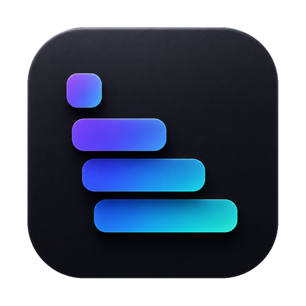

<div align="center">



# yabai-dockstack

**macOS 上 [yabai](https://github.com/koekeishiya/yabai) 的原生視覺增強套件** —— stack 指示器、跨 space 視窗選單、Dock 視窗預覽。不需要 Hammerspoon。

[English](README.md) · 繁體中文

<sub>靈感來自 [stackline](https://github.com/AdamWagner/stackline) 與 DockView ·
關鍵字:yabai、stackline、dockview、macOS 視窗管理、tiling、stack 指示器、
dock 預覽、視窗切換、選單列、Mission Control 替代</sub>

</div>

---

`yabai-dockstack` 幫 yabai 補上它缺的視覺層:

- **Stack 指示器** —— 在每個視窗 stack 旁顯示浮動指示器,讓你一眼看出哪些 app 疊在一起、順序為何(靈感來自 **stackline**)。
- **跨 space 視窗選單** —— 選單列依 Display → Space 列出所有視窗;點一下就跳轉並聚焦。
- **Dock 視窗預覽** —— 滑鼠移到 Dock 圖示,偏看該 app 跨所有 space 的視窗縮圖;點一下跳轉(靈感來自 **DockView**)。

這是用 Swift 重寫的乾淨版本,**不是** stackline 的 fork(stackline 需要 Hammerspoon)。

## 需求

- macOS 14+
- [yabai](https://github.com/koekeishiya/yabai) 已安裝並執行中
- 建置需要 Swift 工具鏈(Xcode 或 Command Line Tools)

## 建置

```sh
./scripts/bundle.sh
```

會在專案根目錄產生 `yabai-dockstack.app`。

> 若 `swift build` 抱怨 Xcode 授權,可改用 Command Line Tools:
> `DEVELOPER_DIR=/Library/Developer/CommandLineTools ./scripts/bundle.sh`

## 安裝(零設定)

```sh
open yabai-dockstack.app
```

啟動後 app 會:

- **自動偵測** yabai 位置(Homebrew Apple Silicon / Intel / nix,再 `which`);
- **自動註冊** 它需要的 yabai signal(指向自己),你完全不用改 `~/.yabairc`。

選單列會顯示 **yabai: connected ✓**,並列出所有視窗(依 Display → Space 分組,
有命名的 space 顯示自訂名稱)。它還提供:

- **Settings…** —— 調整外觀(icon/旗標)、大小、透明度、顏色、底板、滿版靠邊、
  計時(ms)、**yabai 路徑**(留空 = 自動偵測)、**開機自啟**。即時生效並儲存。
- **Re-register yabai signals** —— yabai 重啟後重新註冊 signal。

> 第一次開啟未簽章的 app,macOS 會擋一次:對 app 按右鍵 →「打開」,或執行
> `xattr -dr com.apple.quarantine yabai-dockstack.app`。用 Homebrew cask 安裝則會
> 自動移除 quarantine,不會跳警告。

## Dock 視窗預覽

滑鼠移到 **Dock 的 app 圖示**,會彈出該 app 跨所有 space 的視窗;點一下就跳到那個
space 並聚焦。

- **縮圖**:目前可見 space 的視窗顯示即時縮圖;其他 space 的視窗 macOS 無法即時擷取
  (ScreenCaptureKit 會回 `-3811`),所以顯示**快取的最後一次縮圖**,沒有就退回
  **app 圖示 + 標題**。都可點擊。
- **權限**:需要 **Accessibility**(偵測 Dock hover)+ **Screen Recording**(擷取縮圖);
  首次啟用會提示。缺權限時此功能靜默不啟用,核心的 stack 指示器則完全不需要權限。
- **開關**:Settings →「Dock window previews」(預設開啟)。

## 安裝到 Homebrew(發佈者)

1. 用 `scripts/release.sh` 建 universal `.app` 並打包 zip,發一個 GitHub Release。
2. 開一個 `homebrew-tap` repo,把 `dist/yabai-dockstack.rb` 放進 `Casks/`(填入 sha256)。
3. 使用者:`brew install --cask <帳號>/tap/yabai-dockstack`。

## 授權

MIT。
